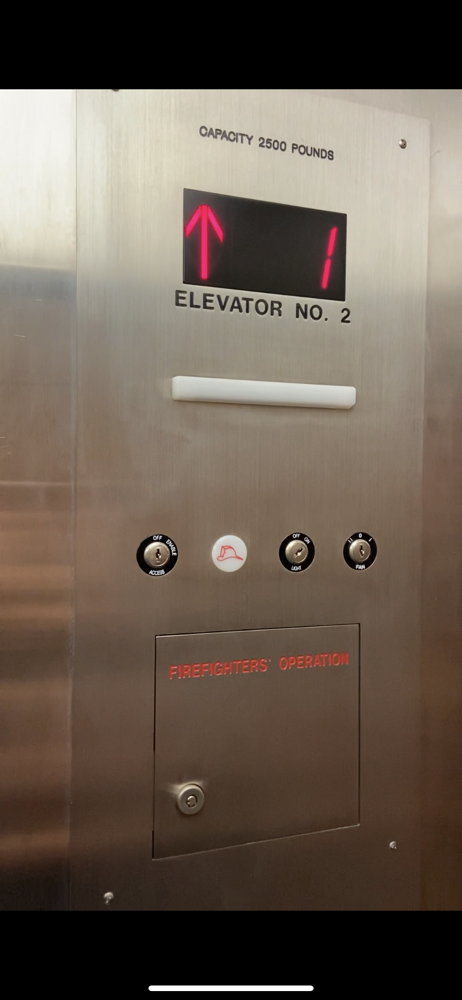
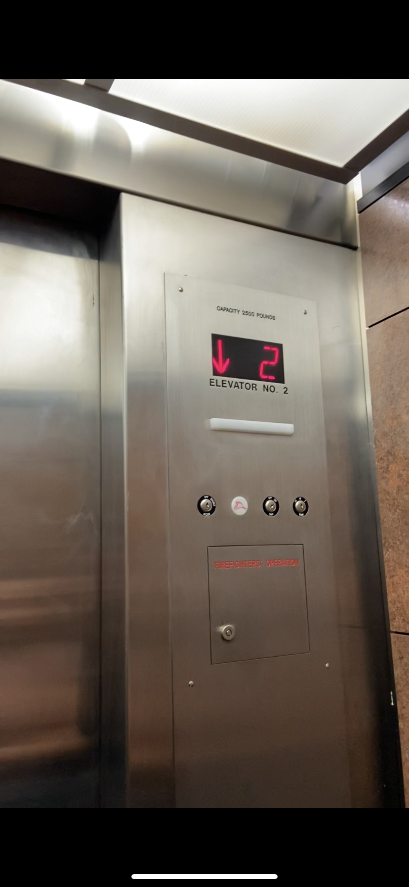
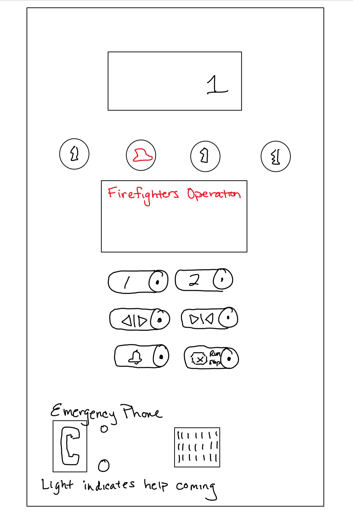

# Report 

**Important Note:**

- The README page is the only page you can interact, so you may want to include all resources/links on this page :)

- **Presentation page:** Go to Settings -> GitHub Pages -> Source: Master branch, to deploy your GitHub page from README. 

- The content of **this** README would be in your GitHub page if there's no index.html file in the main folder.

The report starts from this line

---

### Links
[Presentation page](msilva2248.github.io.) (e.g. https://huyen-nguyen.github.io/hci-template, contains content of this README)

[GitHub repository](https://github.com/msilva2248/p1.Matthew.Silva)

[Demo](https://huyen-nguyen.github.io/hci-template/demo.html) (e.g. https://huyen-nguyen.github.io/hci-template/demo.html, the demo file **should not** be named index.html)

### Getting C:
- Find an elevator in the apartment/campus/hotel. Only one example for each student: The elevator in the ECE building

- Take photos of the control interface

-  Show a gif image of the control interface in operation.

- Find the issues with the current design.

    There seems to be a white rectangular shape and I’m not sure about its purpose. Also, the “close door” button does not provide feedback such as a light to tell the user it’s been pressed. Some might consider the door closing as feedback, but I often continue pressing the button because it takes time for it to actually close. Other than that, the design doesn’t have many issues as it only goes to 2 floors. There are not many components needed which makes it simple to utilize.

- Explain why it is good/bad.

    The design is good as each button clearly states their respective functions. There aren’t many unnecessary components that make you second guess how to utilize the elevator. Most of the buttons provide user feedback. The buttons are low enough and provide braille for anyone with disabilities. The design is partially bad as mentioned above that the “close door” button does not provide feedback.

### Getting B:
- Think about the common things that you use an elevator. List your most common uses and other more rare uses. Does the interface make doing those common things easier?

    The common things I use in an elevator are the floor buttons and the open/close door buttons. Some rarer uses that I’ve never had to utilize are the emergency phone and the fire operation buttons. I believe the interface makes using these easier as it is a basic layout that clearly shows the purpose of each component.

- Think about how the user interacts with the elevator. What is the common sequence of actions?

    The common sequence of actions from the user would include:
    calling the elevator, entering the elevator and selecting floor, possible alternate action – user presses close door button to close faster, other possible alternate action – user presses open door button to wait for other users, exit elevator at chosen floor

- How does the elevator support the user figure out how to make it work?

    It has the firefighter operation area at the top and out of the way of the ordinary user. This also makes it more convenient for the firefighters. It provides an emergency phone and clearly states its purpose should the user need it. Lastly, the buttons clearly show their functions and provide assistance for people with disabilities.

- How does the elevator provide feedback to the user?

    When a button is pressed, a light is displayed to alert the user an action has been taken. Moreover, the selected floor is displayed at the top with an arrow to show the direction and floor the elevator will be going to.

- What are some common mistakes you can make with this current design?

    A common mistake you could make with this design is continuously pressing the “close door” button. I noticed it did not provide feedback during my use, which resulted in pressing the button a couple more times until it closed.

- Suggest the improvements to make on the control interface. Sketch your solution. And justify your design decisions.

### Getting A

- Now, imagine that you can have a touch screen on the elevator

- Come with your design for the touch screen? What is the screen size that you want?

- Design and implement interactive features

- Design and implement user feedback

### Extra credits:

- Your design supports people with disabilities

- You provide extra useful information on the display interface.

- Your imagination ...
